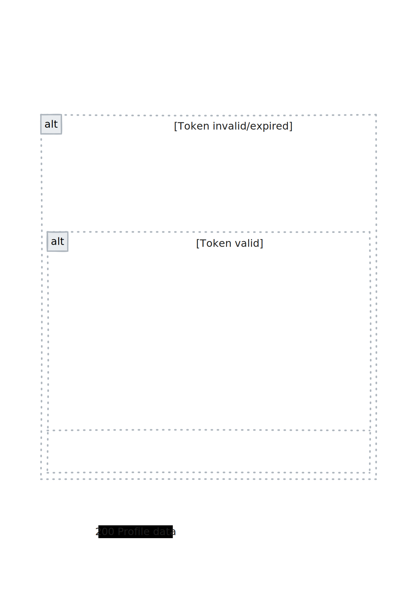

# Django JWT Authentication API

A comprehensive Django REST Framework backend providing secure JWT-based authentication with advanced features including password reset, OTP verification, automated token cleanup, and production-ready deployment configuration.

---

## Table of Contents

- [Project Overview](#project-overview)
- [Key Features](#key-features)
- [Architecture & Tech Stack](#architecture--tech-stack)
- [Quick Start](#quick-start)
- [Backend Setup (Django)](#backend-setup-django)
- [API Endpoints](#api-endpoints)
- [Advanced Features](#advanced-features)
- [Deployment](#deployment)
- [Development Notes](#development-notes)
- [Security & Production](#security--production)

---

## Project Overview

This is a production-ready Django REST Framework backend that provides a complete authentication system with JWT tokens. It's designed as a robust foundation for modern web applications requiring secure user authentication, password management, and automated maintenance features.

**Perfect for:** SaaS applications, mobile app backends, microservices, or any project requiring secure user authentication.

## System Architecture


## Authentication Flow

### Registration & OTP Verification


### Authentication Token Management


### Authenticated Request Security



## Key Features

### 🔐 **Authentication & Security**

- JWT authentication with access & refresh tokens
- Secure HTTP-only cookie storage
- Token rotation & automatic blacklisting
- Rate limiting on sensitive endpoints
- Custom user model with email-based authentication

### 🔑 **Password Management**

- Password reset via email with secure tokens
- Password change for authenticated users
- OTP (One-Time Password) verification system
- OTP resend functionality with rate limiting

### 🤖 **Automated Maintenance**

- Custom management command for token cleanup
- GitHub Actions workflow for daily token cleanup
- Secure cron endpoint with API key authentication
- Automated expired token removal

### 🚀 **Production Ready**

- Environment-based configuration (dev/prod)
- Render.com deployment configuration
- PostgreSQL support for production
- Static file handling with WhiteNoise
- Comprehensive error handling and logging

### 📊 **Developer Experience**

- Postman collection included
- Comprehensive API documentation
- Redis integration for caching
- Django admin interface
- Detailed setup instructions

## Architecture & Tech Stack

### **Backend Framework**

- **Django 5.2.3** - Web framework
- **Django REST Framework 3.16.0** - API framework
- **SimpleJWT 5.5.0** - JWT authentication
- **Django CORS Headers** - Cross-origin requests
- **Django Rate Limit** - API rate limiting

### **Database & Caching**

- **SQLite** (development) / **PostgreSQL** (production)
- **Redis** - Caching and session storage
- **Django Redis** - Redis integration

### **Deployment & DevOps**

- **Gunicorn** - WSGI HTTP Server
- **WhiteNoise** - Static file serving
- **GitHub Actions** - CI/CD automation
- **Render.com** - Cloud deployment platform

### **Security & Utilities**

- **Python Decouple** - Environment variable management
- **dj-database-url** - Database URL parsing
- **Requests** - HTTP library for external API calls

---

## Quick Start

```bash
# Clone the repository
git clone <repository-url>
cd AuthBk

# Create and activate virtual environment
python -m venv .venv
source .venv/bin/activate  # On Windows: .venv\Scripts\activate

# Install dependencies
pip install -r requirements.txt

# Install development dependencies (linters & tools)
pip install -r dev-requirements.txt

# Set up Git hooks for automatic linting & formatting
pre-commit install

# (Optional) Run all pre-commit hooks on the entire codebase
pre-commit run --all-files

# Set up environment variables
cp .env.sample .env

# Create static directory
mkdir -p static

# Run migrations
python manage.py makemigrations users
python manage.py migrate

# Create superuser (optional)
python manage.py createsuperuser

# Start development server
python manage.py runserver
```

The API will be available at `http://localhost:8000/api/`

---

## Backend Setup (Django)

### Prerequisites

- Python 3.8+
- [pip](https://pip.pypa.io/en/stable/)
- Git

### Step-by-Step Local Setup

Follow these steps to set up the project locally without errors:

#### 1. Clone the Repository

```bash
git clone <repository-url>
cd AuthBk
```

#### 2. Create Virtual Environment

```bash
python -m venv .venv
source .venv/bin/activate  # On Windows: .venv\Scripts\activate
```

#### 3. Install Requirements

```bash
pip install -r requirements.txt

# Install development dependencies (linters & tools)
pip install -r dev-requirements.txt

# Set up Git hooks for automatic linting & formatting
pre-commit install

# (Optional) Run all pre-commit hooks on the entire codebase
pre-commit run --all-files
```

#### 4. Set Up Environment Variables

```bash
# Copy the sample environment file
cp .env.sample .env

# Edit .env with your preferred settings (optional for local development)
# The default values in .env.sample work for local development
```

#### 5. Create Static Directory

```bash
mkdir -p static
```

#### 6. Create Database Migrations

```bash
# Create initial migrations for the users app
python manage.py makemigrations users

# Apply all migrations
python manage.py migrate
```

#### 7. Create Superuser (Optional)

```bash
python manage.py createsuperuser
# Follow the prompts to create an admin user
```

#### 8. Run the Development Server

```bash
python manage.py runserver
```

The backend will be available at `http://localhost:8000/`

### Useful Commands

- `python manage.py makemigrations` — Create new migrations
- `python manage.py migrate` — Apply migrations
- `python manage.py flushexpiredtokens` — Remove expired JWT tokens (run periodically)

### Environment Variables

- By default, settings are in `config/settings.py`.
- For production, set `SECRET_KEY`, `DEBUG`, and JWT lifetimes via environment variables (see code comments in `settings.py`).

### Database

- Default: SQLite (file-based, no setup needed)
- For production, configure PostgreSQL or another DB in `config/settings.py`.

---

## Advanced Features

### 🔄 **Automated Token Cleanup**

The system includes automated cleanup of expired JWT tokens:

```bash
# Manual cleanup
python manage.py flushexpiredtokens_daily

# Automated via cron endpoint
curl -X POST -H "X-Cron-Secret: your-secret-key" \
  https://your-domain.com/api/auth/cron/flush-tokens/
```

**GitHub Actions Integration:**

- Daily automated cleanup at midnight UTC
- Secure API key authentication
- Monitoring and error reporting

### 🔐 **Security Features**

- **Rate Limiting:** Prevents brute force attacks
- **CORS Configuration:** Secure cross-origin requests
- **HTTP-Only Cookies:** XSS protection for tokens
- **Token Blacklisting:** Immediate token invalidation
- **Environment-based Settings:** Separate dev/prod configs

### 📧 **Email Integration**

- Password reset emails with secure tokens
- OTP verification system
- Customizable email templates
- Rate limiting on email endpoints

### 🗄️ **Database Support**

- **Development:** SQLite (zero configuration)
- **Production:** PostgreSQL with connection pooling
- **Caching:** Redis integration for performance

### 📱 **API Testing**

- **Postman Collection:** Pre-configured API tests
- **Admin Interface:** Django admin for user management
- **Debug Toolbar:** Development debugging tools

---

## API Endpoints

### Authentication Endpoints (`/api/auth/`)

| Endpoint                         | Method | Description                      | Authentication |
| -------------------------------- | ------ | -------------------------------- | -------------- |
| `/login/`                        | POST   | User login with email/password   | None           |
| `/logout/`                       | POST   | User logout & token blacklisting | Required       |
| `/token/refresh/`                | POST   | Refresh JWT access token         | Refresh Token  |
| `/change-password/`              | POST   | Change user password             | Required       |
| `/send-reset-password-email/`    | POST   | Send password reset email        | None           |
| `/reset-password/<uid>/<token>/` | POST   | Reset password with token        | None           |
| `/verify-otp/`                   | POST   | Verify OTP code                  | None           |
| `/resend-otp/`                   | POST   | Resend OTP code                  | None           |
| `/cron/flush-tokens/`            | POST   | Cleanup expired tokens (cron)    | X-Cron-Secret  |

### User Management Endpoints (`/api/users/`)

| Endpoint     | Method | Description                    | Authentication |
| ------------ | ------ | ------------------------------ | -------------- |
| `/register/` | POST   | Register new user account      | None           |
| `/profile/`  | GET    | Get authenticated user profile | Required       |

### Request/Response Format

- **Content-Type:** `application/json`
- **Authentication:** JWT tokens via HTTP-only cookies
- **Rate Limiting:** Applied to sensitive endpoints
- **CORS:** Configured for frontend integration

---

## Automated Token Cleanup Flow


## Deployment Architecture


---

## Deployment

### 🌐 **Render.com Deployment**

This project is configured for easy deployment on Render.com:

1. **Fork/Clone** this repository
2. **Connect** to Render.com
3. **Environment Variables** - Set in Render dashboard:
   ```
   ENVIRONMENT=production
   SECRET_KEY=your-secret-key
   DATABASE_URL=your-postgres-url
   CRON_SECRET_KEY=your-cron-secret
   ```
4. **Deploy** using the included `render.yaml`

### 🔄 **GitHub Actions Setup**

For automated token cleanup:

1. Add `CRON_SECRET_KEY` to GitHub Secrets
2. Update the domain in `.github/workflows/trigger_flush_endpoint.yml`
3. The workflow runs daily at midnight UTC

### 📊 **Environment Configuration**

- **Development:** Uses SQLite, debug mode enabled
- **Production:** PostgreSQL, optimized settings, static file serving
- **Settings:** Environment-based configuration in `config/settings/`

---

## Development Notes

### 🔧 **Useful Commands**

```bash
# Database operations
python manage.py makemigrations
python manage.py migrate
python manage.py createsuperuser

# Token management
python manage.py flushexpiredtokens_daily

# Development server
python manage.py runserver

# Static files (production)
python manage.py collectstatic
```

### 🛠️ **Code Quality & Git Hooks**

This project uses [pre-commit](https://pre-commit.com/) hooks (configured in `.pre-commit-config.yaml`) together with tool settings in `pyproject.toml` to automatically lint and format code on every commit.

```bash
# After installing requirements as shown above
pip install -r dev-requirements.txt
pre-commit install  # installs the git hooks

# Optional: run all hooks on the entire repository
pre-commit run --all-files
```

### 📝 **Project Structure**

```
AuthBk/
├── apps/
│   ├── authentication/    # JWT auth, password reset, OTP
│   └── users/            # User registration, profile
├── config/
│   ├── settings/         # Environment-based settings
│   └── urls.py           # Main URL configuration
├── .github/workflows/    # GitHub Actions
├── static/              # Static files
└── requirements.txt     # Python dependencies
```

### 🔍 **Testing & Debugging**

- **Admin Panel:** `/admin/` - Manage users and tokens
- **Postman Collection:** `AuthAPI.postman_collection.json`
- **Redis Documentation:** `redis.md`
- **API Documentation:** `scheduled_api_trigger.md`

---

## Security & Production

### 🔒 **Security Best Practices**

- **Environment Variables:** Never commit secrets to version control
- **HTTPS Only:** Set `JWT_AUTH_SECURE = True` in production
- **Rate Limiting:** Configured on sensitive endpoints
- **Token Security:** HTTP-only cookies prevent XSS attacks
- **CORS Policy:** Restrictive cross-origin configuration

### 🚀 **Production Checklist**

- [ ] Set `DEBUG = False`
- [ ] Configure `ALLOWED_HOSTS`
- [ ] Set up PostgreSQL database
- [ ] Configure Redis for caching
- [ ] Set all environment variables
- [ ] Enable HTTPS
- [ ] Set up automated backups
- [ ] Configure monitoring and logging
- [ ] Test all API endpoints
- [ ] Set up GitHub Actions for token cleanup

---

## License

This project is provided for educational/demo purposes. Adapt and use as needed for your own projects.
